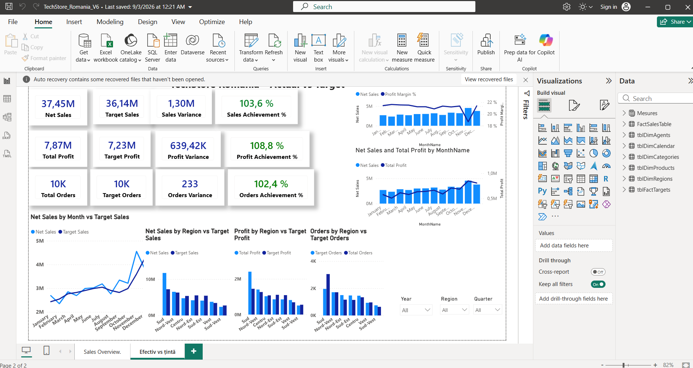

# TechStore Romania - Power BI Dashboard

Power BI dashboard created for a fictional retail / e-commerce business in Romania.

The project focuses on sales performance, profit, orders and target achievement, with interactive analysis by month, region and reporting period.

## Preview

## Project Overview

This dashboard was built as a portfolio project to demonstrate Power BI reporting, data modelling, KPI tracking and business performance analysis.

It helps answer questions such as:

- How are net sales, profit and orders performing against targets?
- Which months have the strongest or weakest performance?
- Which regions are above or below target?
- How do sales and profit trends evolve over time?

## Tools Used

- Power BI
- Power Query
- DAX
- Data modelling
- KPI reporting
- Dashboard design

## Dashboard Pages

- Sales Overview
- Actual vs Target analysis

## Key Features

- Net Sales, Total Profit and Total Orders KPIs
- Sales, profit and orders variance against targets
- Achievement percentage indicators
- Monthly trend analysis
- Regional performance comparison
- Interactive filters by year, region and quarter

## Files

- `TechStore_Romania_V6.pbix` - Power BI project file
- `screenshots/` - dashboard preview images
- `data/` - optional source data, if included

## Notes

The data used in this project is fictional / sample data and is intended for portfolio and learning purposes.
